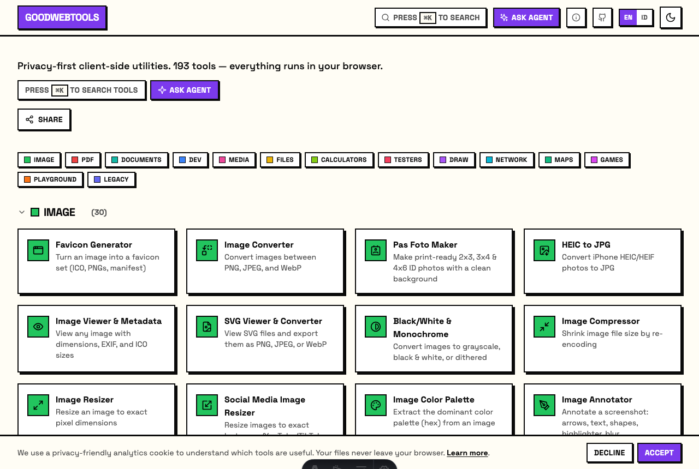
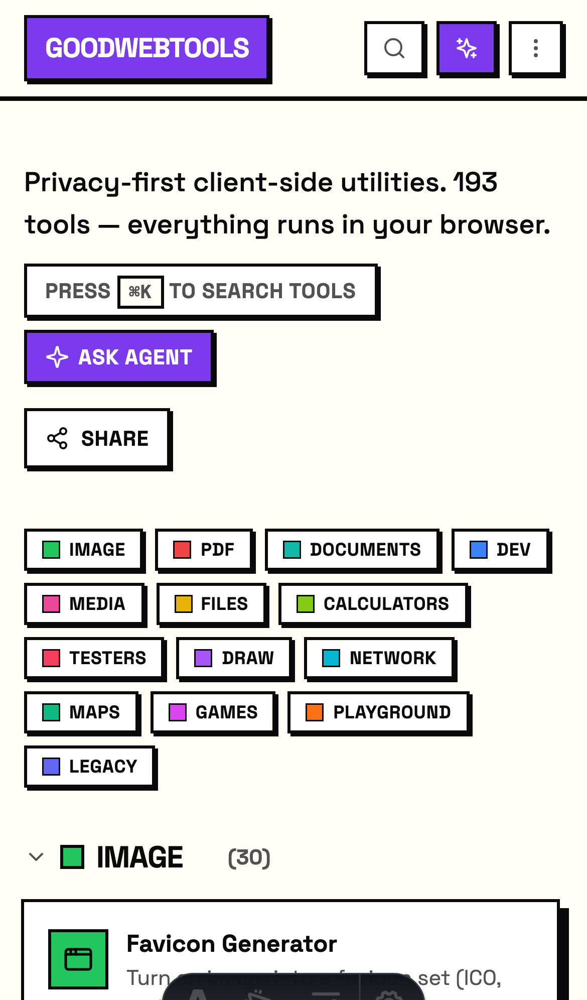
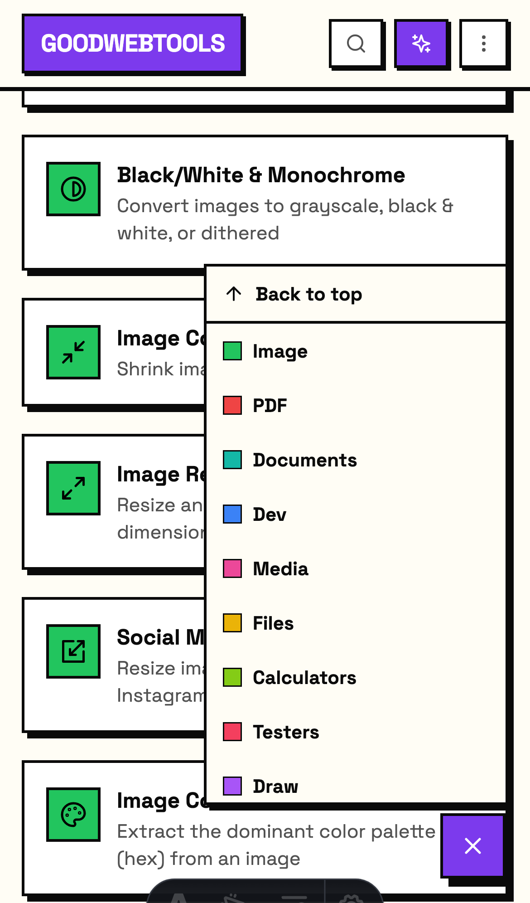
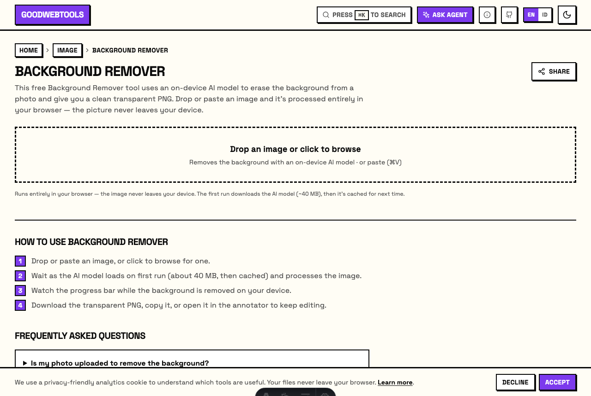
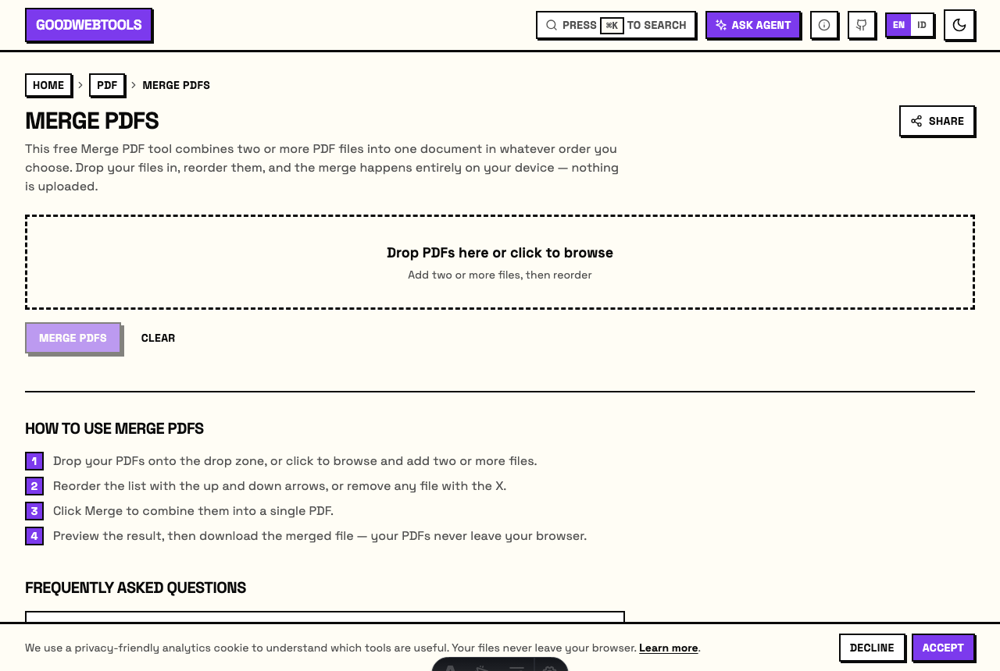
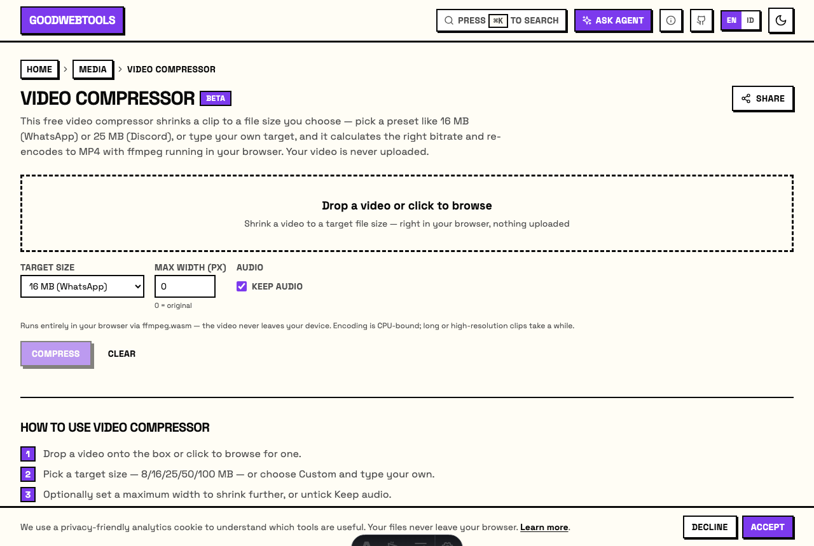
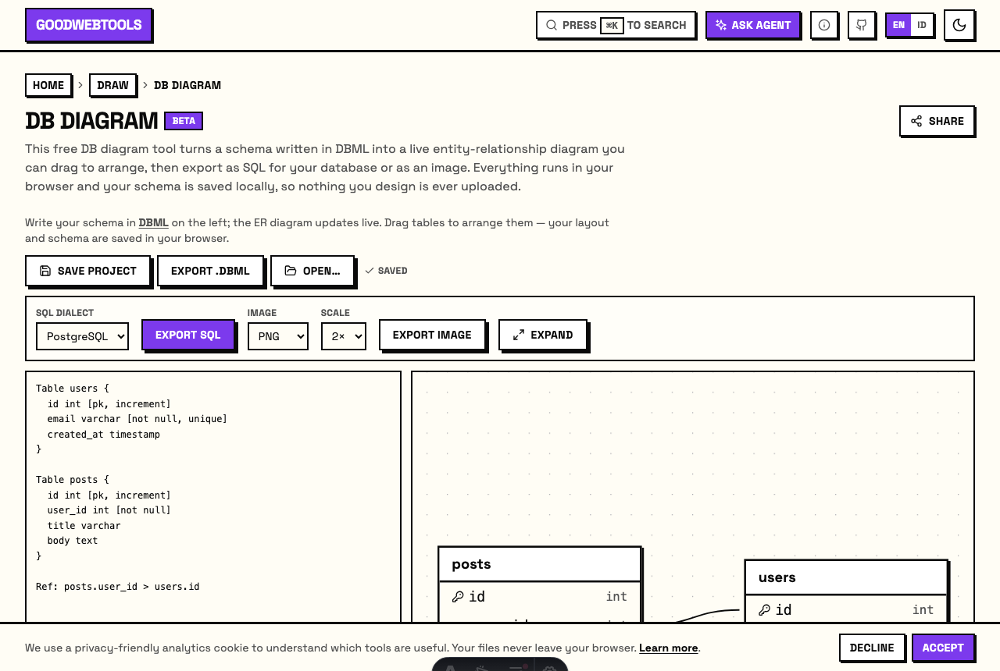
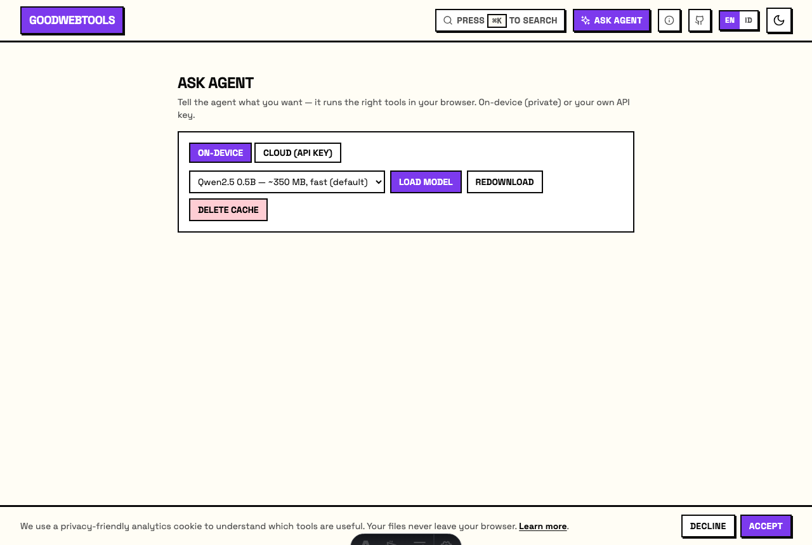

<div align="center">

# GoodWebTools — 193 Free, Privacy-First Web Tools That Run in Your Browser

**Compress images, edit PDFs, remove backgrounds, decode JWTs, scan QR codes, and 180+ more — with nothing ever uploaded.** Every tool runs 100% client-side with WebAssembly, Canvas, and on-device AI, so your files never leave your device.

[**🚀 Open goodwebtools.com**](https://goodwebtools.com) · [**🖥️ Desktop app**](https://github.com/slaveofcode/goodwebtools/releases) · [**🤖 Ask Agent**](https://goodwebtools.com/ask-agent)


[](./LICENSE)
[](https://goodwebtools.com)
[](https://goodwebtools.com)
[](#contributing)

<table>
  <tr>
    <td width="58%"></td>
    <td width="21%"></td>
    <td width="21%"></td>
  </tr>
  <tr>
    <td align="center"><em>Desktop</em></td>
    <td align="center"><em>Mobile</em></td>
    <td align="center"><em>Mobile category menu</em></td>
  </tr>
</table>

⭐ **If GoodWebTools is useful, star the repo — it helps other people find privacy-first tools.**

</div>

## Why GoodWebTools?

Most "online tools" quietly **upload your files to a server**. GoodWebTools does all the work **in your browser** — with WebAssembly, Canvas, the File System Access API, and on-device machine-learning models — so:

- 🔒 **Nothing is uploaded.** Your images, PDFs, videos, and text stay on your device.
- ⚡ **No sign-up, no limits, no watermarks.** Just open a tool and use it.
- 📶 **Works offline.** It's an installable PWA — cache it once, use it on a plane.
- 🖥️ **Native desktop app** (Windows / macOS / Linux) built with Tauri, for tools that want the filesystem.
- 🤖 **Built-in AI agent** that drives the tools for you — fully on-device, or with your own API key.

## Tools

**193 tools across 13 categories.** Here's a taste — [**browse them all at goodwebtools.com**](https://goodwebtools.com).

| Category | Preview | Popular tools |
|---|---|---|
| **🖼️ Image** (30) | <a href="https://goodwebtools.com/tools/image-bg-remove"></a> | [Background Remover](https://goodwebtools.com/tools/image-bg-remove) · [Image Compressor](https://goodwebtools.com/tools/image-compress) · [Image Converter](https://goodwebtools.com/tools/image-convert) · [HEIC to JPG](https://goodwebtools.com/tools/image-heic-to-jpg) · [Favicon Generator](https://goodwebtools.com/tools/favicon-generator) |
| **📄 PDF** (20) | <a href="https://goodwebtools.com/tools/pdf-merge"></a> | [Merge PDF](https://goodwebtools.com/tools/pdf-merge) · [Organize PDF](https://goodwebtools.com/tools/pdf-organize) · [Fill & Sign PDF](https://goodwebtools.com/tools/pdf-fill) · [Extract Images](https://goodwebtools.com/tools/pdf-extract-images) · [Add Page Numbers](https://goodwebtools.com/tools/pdf-page-numbers) |
| **🎬 Media** (21) | <a href="https://goodwebtools.com/tools/video-compress"></a> | [Video Compressor](https://goodwebtools.com/tools/video-compress) · [Subtitle Editor](https://goodwebtools.com/tools/subtitle-editor) · [Voice Recorder](https://goodwebtools.com/tools/voice-recorder) · [White Noise](https://goodwebtools.com/tools/white-noise) |
| **🎨 Draw** (3) | <a href="https://goodwebtools.com/tools/db-diagram"></a> | [DB Diagram (DBML)](https://goodwebtools.com/tools/db-diagram) · [Whiteboard](https://goodwebtools.com/tools/whiteboard) · [Signature Pad](https://goodwebtools.com/tools/signature) |
| **💻 Dev** (57) | — | [JSON Formatter](https://goodwebtools.com/tools/json-format) · [Base64](https://goodwebtools.com/tools/base64) · [JWT Decoder](https://goodwebtools.com/tools/jwt-decode) · [URL Encode/Decode](https://goodwebtools.com/tools/url-encode) · [UUID Generator](https://goodwebtools.com/tools/uuid-gen) |
| **📇 Documents** (13) | — | [PPTX Viewer](https://goodwebtools.com/tools/pptx-viewer) · [PPTX to PDF](https://goodwebtools.com/tools/pptx-to-pdf) · [EML Email Viewer](https://goodwebtools.com/tools/eml-viewer) · [GEDCOM Viewer](https://goodwebtools.com/tools/gedcom-viewer) |
| **🧮 Calculators** (17) | — | [Percentage Calculator](https://goodwebtools.com/tools/percentage-calculator) · [Time Zone Converter](https://goodwebtools.com/tools/timezone-converter) · [Countdown Timer](https://goodwebtools.com/tools/countdown) · [Roman Numerals](https://goodwebtools.com/tools/roman-numerals) |
| **🗂️ Files** (6) | — | [Compress to Size](https://goodwebtools.com/tools/compress-to-size) · [File Encrypt/Decrypt](https://goodwebtools.com/tools/file-crypt) · [Zip / Unzip](https://goodwebtools.com/tools/zip) · [Archive Extractor](https://goodwebtools.com/tools/archive-extract) |
| **🔬 Testers** (7) | — | [Device Test](https://goodwebtools.com/tools/device-test) · [Microphone Test](https://goodwebtools.com/tools/mic-test) · [Webcam Test](https://goodwebtools.com/tools/webcam-test) · [Keyboard Test](https://goodwebtools.com/tools/keyboard-test) |
| **🗺️ Maps** (4) | — | [Coordinate Converter](https://goodwebtools.com/tools/coord-convert) · [Map Explorer](https://goodwebtools.com/tools/map-explorer) · [GeoJSON/GPX/KML Viewer](https://goodwebtools.com/tools/geo-viewer) · [Static Map Maker](https://goodwebtools.com/tools/static-map) |
| **🌐 Network** (3) | — | [P2P File Transfer](https://goodwebtools.com/tools/file-transfer) · [Video Call](https://goodwebtools.com/tools/video-call) · [Optical File Transfer](https://goodwebtools.com/tools/optical-transfer) |
| **🎮 Games** (7) | — | [Wheel Spinner](https://goodwebtools.com/tools/wheel-spinner) · [2048](https://goodwebtools.com/tools/2048) · [Block Puzzle](https://goodwebtools.com/tools/block-puzzle) · [Dino Run](https://goodwebtools.com/tools/dino-run) |
| **🧪 Playground** (4) | — | [Code Scratchpad](https://goodwebtools.com/tools/code-scratchpad) · [SQLite Playground](https://goodwebtools.com/tools/sqlite-playground) · [Online Notepad](https://goodwebtools.com/tools/notepad) · [Quick To-Do](https://goodwebtools.com/tools/todo) |

## 🤖 Ask Agent — the tools, driven for you

<a href="https://goodwebtools.com/ask-agent"></a>

Tell it what you want in plain language — *"compress this image to 100 KB"*, *"merge these PDFs"*, *"remove duplicate rows from this CSV and convert to Excel"* — and it picks the right tools, chains them, and hands back the result. It runs a small model **fully on-device** (WebGPU), or you can plug in **your own OpenAI-compatible / Anthropic API key**. Either way, the processing stays in your browser.

## Tech

- [**Astro**](https://astro.build) static site + **React islands** (each tool is its own lazy-loaded chunk)
- **100% client-side processing**: WebAssembly, Canvas, `onnxruntime-web`, `@imgly/background-removal`, `mupdf`, `ffmpeg.wasm`, `transformers.js` / WebGPU
- Installable **PWA** with offline support
- Native **desktop app** via [Tauri 2](https://tauri.app)
- Deployed on **Cloudflare Workers** (static assets + R2 for on-demand ML models)

## Run locally

```bash
npm install --legacy-peer-deps
npm run dev            # http://localhost:4321
```

Build a production bundle with `npm run build`, run tests with `npx vitest run`.

## Contributing

PRs are very welcome — new tools, fixes, and translations. Every tool is a **thin React island** (`src/islands/<category>/`) over a **pure, unit-tested library** (`src/tools/<category>/*.lib.ts`), registered in `src/registry/tools.ts`. The golden rule: **keep everything client-side** — if a feature would need a server, it doesn't fit GoodWebTools.

1. Fork & branch (`feat/<your-tool>`)
2. Add your `*.lib.ts` (with tests) + a thin island, register it in `tools.ts`, add SEO copy in `tool-seo.ts`
3. `npx vitest run && npm run lint && npm run build`
4. Open a PR

See [`CONTRIBUTING.md`](./CONTRIBUTING.md) and [`DEPLOYMENT.md`](./DEPLOYMENT.md) for the full workflow and self-hosting guide.

## License

[MIT](./LICENSE) — free to use, self-host, and build on.
</content>
</invoke>
